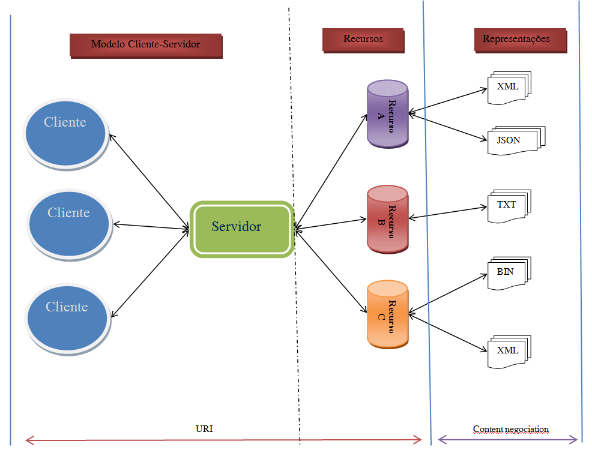

# REST API
Para começar, uma interface de programação de aplicação (_API_) é aquela que define as regras e padrões de comunicação entre sistemas de software. As APIs são criadas para que aplicações possam se comunicar de forma programática, ou seja, a API age como uma espécie de "tradutor" entre as aplicações.

Já o termo _REST_ (Representational State Transfer) é um estilo arquitetural que estabelece um conjunto de diretrizes e restrições para o desenvolvimento de serviços web utilizando o protocolo HTTP como base. Quando dizemos que um serviço é _RESTful_ significa que ele respeita as restrições (_constraints_) do _REST_ que envolvem o uso de URIs (Identificadores Uniformes de Recursos) para identificar recursos, a adoção de verbos HTTP para especificar as ações a serem realizadas em relação a esses recursos, e a transmissão de informações em formatos amplamente reconhecidos, como JSON (Notação de Objetos JavaScript) ou XML (Linguagem de Marcação Extensível). Todas essas _constraints_ fazem com que serviço adquira vantagens relevantes as quais serão abordadas a frente.

Dessa forma, quando falamos de uma _API RESTful_ simplesmente estamos dizendo que a _API_ atende as _constraints_ necessárias do _REST_ podendo assim ser considerada _RESTful_. Se uma API é considerada _RESTful_ também significará que a mesma terá certas vantagens notáveis como: melhor uniformidade da interface, alta escalabilidade, maior confiabilidade, melhor eficiência e perfomance, bem como uma melhor segurança. Essas vantagens se fazem presentes graças a natureza das _constraints_ impostas as quais serão destrinchadas em breve.

## Clientes e Recursos
Os **clientes** são usuários ou sistemas de software interessados em obter informações da web. Eles podem ser pessoas ou softwares que interagem com a API para acessar dados ou funcionalidades específicas. Já os **recursos** referem-se aos dados ou informações disponibilizados por diversas aplicações para seus usuários. Estes podem incluir uma variedade de tipos de dados, como imagens, vídeos, texto ou números. A maquina que é reponsável por disponibilizar o recurso ao cliente é normalmente chamada de **servidor**.


## Constraints
No geral, temos 6 restrições (sendo 5 delas obrigatórias e 1 opcional) para que uma _API_ seja considerada verdadeiramente _RESTful_:

1. ### Client-Server
   A restricão _Client-Server_, como seu nome já diz, separa o cliente do servidor para que suas aplicações **devam** ser capazes de evoluir sozinhas sem interdependência. Dessa forma, um cliente deve conhecer apenas URIs (Uniform Resource Identifiers) de recurso. Essa distinção permite que diferentes tipos de clientes (navegadores web, aplicativos móveis, dispositivos IoT, etc..) interajam de forma consistente com o servidor, sem necessariamente modificar a lógica de negócios do mesmo.

    Alguns Exemplos de URIs:
    ````
    https://pt.wikipedia.org/wiki/Hypertext_Transfer_Protocol
    https://github.com/torvalds/linux
    https://www.netflix.com/browse
    ````

2. ### Uniform interface 
    Esse princípio é um dos mais intrínsecos a arquitetura _REST_ ele implica que os recursos da _API_ devem ser identificados de forma exclusiva por meio de URIs e as operações realizadas com esses recursos devem seguir um padrão. Isso é possível graças a utlização de verbos HTTP (GET, PUT, POST, DELETE) para realização de operações CRUD nos recursos da _API_. Ademais, a forma como os recursos são representados (utilizando um arquivo JSON ou XML, por exemplo) deve seguir um padrão bem definido o que facilita a interoperabilidade entre sistemas e clientes diversos.

    ````
    Exemplo simples de um JSON representando recursos em uma _API RESTful_:
    ```
        {
    "usuarios": [
        {
        "id": 1,
        "nome": "João Silva",
        "email": "joao@hotmail.com"
        },
        {
        "id": 2,
        "nome": "Maria Souza",
        "email": "maria@gmail.com"
        },
        {
        "id": 3,
        "nome": "Carlos Oliveira",
        "email": "carlos@protonmail.com"
        }
    ]
    }
    ```
3. ### Stateless 
   A restrição _stateless_ implica que nenhum estado (contexto ou informação do cliente) deve ser armazenado pelo servidor, ou seja, cada requisição enviada pelo cliente deve conter todos os dados necessários para que o servidor entenda e complete-a sem necessitar de nenhum estado mantido pelo mesmo entre as requisições. A restrição favorece a escalabilidade horizontal já que não é preciso, necessariamente, associar as requisições enviadas por um cliente com sempre o mesmo servidor mas sim com qualquer outro presente na infraestrutura.
   
4. ### Cacheable
   A restrição _Cacheable_ determina que as respostas da _API_ devem ser explicitamente marcadas como cacheáveis ou não-cacheáveis, utilizando cabeçalhos HTTP apropriados. O cache pode ser implementado em diferentes níveis e pode ser configurado para diferentes estratégias. O uso eficaz de cache pode resultar em uma melhoria significativa na eficiência, perfomance e na escalabilidade da API, especialmente em cenários onde os dados são estáticos ou mudam com pouca frequência.
5. ### Layered system
   O princípio do sistema em camadas elenca que não importa o quão complexos estão sendo os passos que o servidor está realizando para atender as requisições ou quantas camadas diferentes ele teve de percorrer (é possível, por exemplo, que as _APIs_ estejam implantadas no servidor X e os dados armazenados no Y) o cliente não precisa saber destes detalhes quando acessa um enpoint. Esse princípio também vem acompahado de uma significativa melhora na segurança.

    
    
6. ### Code on Demand (_opcional_)
   Code on Demand é uma _constraint_ opcional para tornar uma *API* *RESTful* mas ela configura um recurso interessante caso seja bem utilizado. O princípio se refere a capacidade de retornar não apenas representações estáticas de recursos na forma de JSON ou XML mas também um código executável, por exemplo, os clientes podem chamar sua API para obter  scripts, applets ou outras formas de código que são transferidas do servidor para o cliente e executadas localmente.